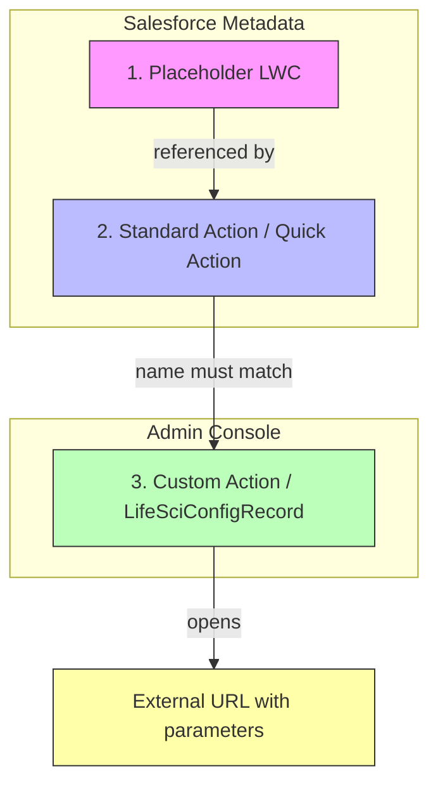
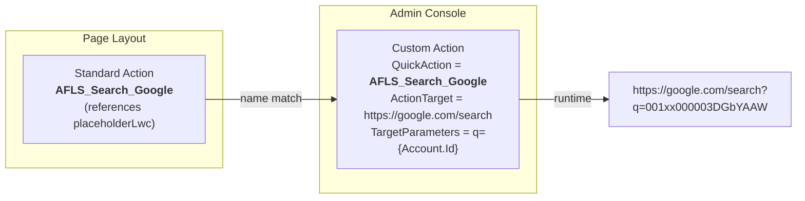

# LSC Custom Action Starter Kit

<a href="https://githubsfdeploy.herokuapp.com">
  
</a>

Deploy URL-based Custom Actions to Life Sciences Cloud that open external websites with dynamic record data (e.g., Google Search).

## How It Works

Custom Actions on LSC Record Pages require **three components** working together:



### 1. Placeholder LWC (`placeholderLwc`)

An empty Lightning Web Component that acts as a stub. Custom Actions on Record Pages require a corresponding Standard Action (Quick Action) on the page layout, and Standard Actions of type `LightningWebComponent` need an actual LWC to reference. This placeholder serves that purpose.

**Key config** in `placeholderLwc.js-meta.xml`:
- `target`: `lightning__RecordAction` — makes it available as a Quick Action
- `actionType`: `ScreenAction`

### 2. Standard Action / Quick Action (`Account.<Name>`)

A Salesforce Quick Action on the Account object that references the placeholder LWC. This is what you drag onto the **Account Page Layout** under "Salesforce Mobile and Lightning Experience Actions".

**Important:** The file must be named `Account.<ActionName>.quickAction-meta.xml` in the `quickActions/` directory. The `Account.` prefix scopes it to the Account object — without it, the action deploys as Global.

### 3. Custom Action / LifeSciConfigRecord

The actual action configuration stored as a `LifeSciConfigRecord` (Tooling API object). This is what appears in the **Admin Console > Quick and Custom Action Administration > Custom Actions**.

**Key fields:**

| Field | Description | Example |
|-------|-------------|---------|
| `ActionTarget` | Base URL to open | `https://www.google.com/search` |
| `ActionType` | `URL`, `App`, or `Utterance` | `URL` |
| `EntityType` | Where the action appears | `SObject` |
| `EntityName` | Which object | `Account` |
| `TargetType` | `External` (browser) or `Inline` (in-app modal) | `External` |
| `TargetParameters` | Query string with merge fields | `q={Account.Id}` |
| `QuickAction` | **Must match** the Standard Action name | `AFLS_Search_Google` |

### How They Connect



The **QuickAction** field in the Custom Action must exactly match the **Name** of the Standard Action on the page layout. This is how LSC links the page layout button to the URL behavior.

## Included Examples

### Google Search (`CustomAction_AccountSearchGoogle`)

Opens Google with the account ID as the search query.

| Field | Value |
|-------|-------|
| Action Target | `https://www.google.com/search` |
| Target Parameters | `q={Account.Id}` |
| Quick Action | `AFLS_Search_Google` |

**Result:** `https://www.google.com/search?q=001xx000003DGbYAAW`

## Deployment

### Option 1: Deploy to Salesforce Button

Click the button at the top of this README.

### Option 2: SF CLI

```bash
# Clone the repo
git clone <repo-url>
cd Custom_Action_Starter_Kit

# Create sfdx-project.json (gitignored)
cat > sfdx-project.json << 'EOF'
{
  "packageDirectories": [{ "path": "force-app", "default": true }],
  "sourceApiVersion": "66.0"
}
EOF

# Deploy to your org
sf project deploy start --source-dir force-app --target-org <your-org-alias>
```

### Post-Deploy Steps

1. **Add Standard Actions to Page Layout:**
   Go to Setup > Object Manager > Account > Page Layouts > select your layout > drag `AFLS_Search_Google` into the **"Salesforce Mobile and Lightning Experience Actions"** section.

2. **Regenerate Metadata Cache:**
   Go to Admin Console > generate a new metadata cache for the relevant profiles.

## Creating Your Own Custom Action

1. **Create a Standard Action** — copy one of the existing `.quickAction-meta.xml` files, rename to `Account.<YourActionName>.quickAction-meta.xml`, and update the label.

2. **Create a Custom Action** — copy one of the existing `.lifeSciConfigRecord-meta.xml` files, rename, and update:
   - `ActionTarget` — your URL
   - `TargetParameters` — query string with `{Account.FieldName}` merge fields
   - `QuickAction` — must match the Standard Action name from step 1
   - `masterLabel` — display label in Admin Console

3. **Deploy** both files, add the Standard Action to the page layout, and regenerate the cache.

## Repo Structure

```
force-app/main/default/
├── lwc/placeholderLwc/                  # Empty LWC stub
│   ├── placeholderLwc.html
│   ├── placeholderLwc.js
│   └── placeholderLwc.js-meta.xml
├── quickActions/                        # Standard Actions (scoped to Account)
│   └── Account.AFLS_Search_Google.quickAction-meta.xml
└── lifeSciConfigRecords/                # Custom Action configs
    └── CustomAction_AccountSearchGoogle.lifeSciConfigRecord-meta.xml
```
